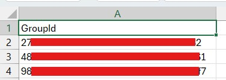
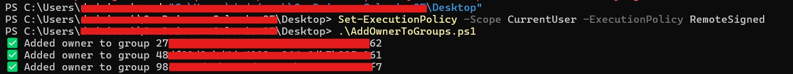

# Bulk Add a User as Owner to Microsoft Entra ID (Azure AD) Groups

This guide explains how to **bulk add a user as owner** to multiple Microsoft Entra (Azure AD) / Microsoft 365 groups using **Microsoft Graph PowerShell**.

It includes steps to install PowerShell 7, required modules, preparing your CSV, and running a ready-to-use script.

---

## Table of Contents

1. [Prerequisites](#prerequisites)  
2. [Install PowerShell 7](#install-powershell-7)  
3. [Install Microsoft Graph PowerShell Modules](#install-microsoft-graph-powershell-modules)  
4. [Prepare CSV File](#prepare-csv-file)  
5. [PowerShell Script](#powershell-script)  
6. [Commands to Run Before Running the Script](#commands-to-run-before-running-the-script)  
7. [Run the Script](#run-the-script)  
8. [Verify Changes](#verify-changes)  

---

## Prerequisites

- Windows 10/11 or later  
- Microsoft 365 / Entra ID account with **Global Admin or Groups Admin** permissions  
- The user you want to add as owner must exist in Entra ID  
- PowerShell 7 recommended for latest Graph SDK support  

Note: You will need to authenticate with your Azure admin account when connecting to Microsoft Graph.

---

## Install PowerShell 7

1. Download the latest **PowerShell 7** from [https://aka.ms/powershell-release](https://aka.ms/powershell-release)  
2. Run the installer and follow the prompts  
3. Verify installation:

```powershell
pwsh
$PSVersionTable.PSVersion
```

It should show **Major version 7 or higher**.

---

## Install Microsoft Graph PowerShell Modules

Open **PowerShell 7 (pwsh)** and run:

```powershell
# Install the base Microsoft.Graph module
Install-Module Microsoft.Graph -Scope CurrentUser -Force

# Install specific submodules
Install-Module Microsoft.Graph.Groups -Scope CurrentUser -Force
Install-Module Microsoft.Graph.Users -Scope CurrentUser -Force

# Import the modules
Import-Module Microsoft.Graph.Groups -Force
Import-Module Microsoft.Graph.Users -Force
Import-Module Microsoft.Graph.Authentication -Force

# Verify available commands in Groups module
Get-Command -Module Microsoft.Graph.Groups
```

---

## Prepare CSV File

Create a CSV file listing the **Group IDs** you want to add the user to. Example:

**UserGroups.csv**

```csv
GroupId
11111111-1111-1111-1111-111111111111
22222222-2222-2222-2222-222222222222
...
```



- Save the CSV to a known path, e.g., `C:\Users\<YourUser>\Desktop\UserGroups.csv`  
- Header **must be `GroupId`**  

---

## PowerShell Script

Create a file called `add-owner-to-groups.ps1` and paste the following code:

```powershell
# CSV path
$csvPath = "C:\Users\<YourUser>\Desktop\UserGroups.csv"

# The user to add as owner (replace with actual UPN)
$userUPN = "test.user@mcompany.com"

# Get the user object
$user = Get-MgUser -UserId $userUPN
if (-not $user) {
    Write-Error "User $userUPN not found. Exiting."
    return
}

# Import the CSV
$groups = Import-Csv $csvPath
if (-not $groups) {
    Write-Error "No groups found in CSV. Exiting."
    return
}

# Loop through each group and add the user as owner
foreach ($group in $groups) {
    try {
        $body = @{ "@odata.id" = "https://graph.microsoft.com/v1.0/users/$($user.Id)" }
        New-MgGroupOwnerByRef -GroupId $group.GroupId -BodyParameter $body
        Write-Host "✅ Added owner to group $($group.GroupId)"
    }
    catch {
        Write-Warning "⚠ Failed for group $($group.GroupId): $($_.Exception.Message)"
    }
}

Write-Host "Finished processing all groups."
```

> Replace `$userUPN` with the actual user UPN you want to add as owner.

---

## Commands to Run Before Running the Script

1. Open PowerShell 7  
2. Allow script execution:

```powershell
Set-ExecutionPolicy RemoteSigned -Scope CurrentUser -Force
```

3. Connect to Microsoft Graph:

```powershell
Connect-MgGraph -Scopes "Group.ReadWrite.All","User.Read.All"
```

4. Verify the user exists:

```powershell
Get-MgUser -UserId "test.user@mcompany.com"
```

5. Verify the modules and cmdlets are loaded:

```powershell
Import-Module Microsoft.Graph.Groups -Force
Import-Module Microsoft.Graph.Users -Force
Import-Module Microsoft.Graph.Authentication -Force
Get-Command -Module Microsoft.Graph.Groups
```

---

## Run the Script

Navigate to the script folder and run it:

```powershell
cd "C:\Users\<YourUser>\Desktop"
& "C:\Users\<YourUser>\Desktop\add-owner-to-groups.ps1"

or once you re in the desktop directory, run:

.\add-owner-to-groups.ps1
```

- Authenticate if prompted  
- You should see output like:

```
✅ Added owner to group 11111111-1111-1111-1111-111111111111
```



---

## Verify Changes

Check one group to confirm the user was added as an owner:

```powershell
Get-MgGroupOwner -GroupId 11111111-1111-1111-1111-111111111111
```

You should see the user listed. Repeat for a few groups to ensure all have been updated.

---

✅ This completes the bulk assignment of a user as owner to multiple groups using Microsoft Graph PowerShell.

